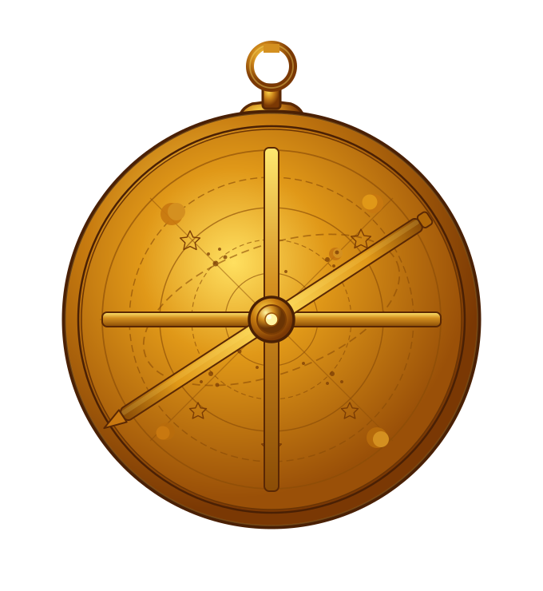

<p align="center">
  
</p>

<h1 align="center">Astrolabe</h1>

<p align="center">A simple, lightweight starter for personal blogs.<br/> Built-in Markdown posts, dark mode, RSS, tags, authors, table of contents.</p>

---

> **astrolabe** _(n.)_ — from Greek _astrolabos_, "star-taker." An ancient instrument used by navigators and astronomers from the Hellenistic period through the medieval Islamic world to measure the altitude of celestial bodies and find their bearings. Travelers carried one to know where they were and where they could go.
>
> This template is named for it because that's roughly the job: a small, well-made tool for finding your way and writing about it.

## Quickstart

```bash
git clone https://github.com/yourname/astrolabe.git
cd astrolabe
npm install
npm run dev
```

Open `http://localhost:4321`. Edit `src/config/site.ts` to set your title, then drop a new post in `src/content/blog/`.

## What's in the box

- **Astro 6** static output — ~5 KB JS by default
- **Tailwind CSS v4** with light/dark theme tokens
- **TypeScript** strict mode
- **Markdown blog** with Zod-validated frontmatter, table of contents, related posts, prev/next nav
- **Tag pages** at `/blog/tags/<tag>/`
- **Author profiles** at `/authors/<slug>/` — bio, links, projects
- **RSS feed** at `/rss.xml`
- **JSON-LD** structured data (`BlogPosting`, `Person`, `BreadcrumbList`)
- **Pagination**, **dark mode toggle**, **view transitions**
- **Sitemap** auto-generated
- **Atomic-design** components (atoms / molecules / organisms / utilities)
- **Agent skills** at `.agents/skills/` (content-writer, image-optimizer, frontend-design, skill-creator)

## Commands

```bash
npm run dev          # dev server at http://localhost:4321
npm run build        # static output to dist/
npm run preview      # serve the build
npm run type-check   # astro check
npm run lint
npm run format
```

## Project layout

```
.agents/skills/      # portable agent skills (Cursor, Codex, Gemini CLI, …)
docs/                # documentation (start here)
scripts/             # one-off utilities (image optimizer)
public/              # static assets (favicon, images)
src/
├── components/      # atomic-design components
├── config/site.ts   # site title, nav, posts-per-page
├── content/         # blog posts + Zod schema
├── data/authors.ts  # author profiles
├── layouts/         # BaseLayout, PageLayout
├── lib/             # tiny helpers (slugify)
├── pages/           # routes
└── styles/          # Tailwind theme + base styles
```

## Documentation

Detailed guides live in [`/docs`](./docs/):

- [Getting started](./docs/getting-started.md) — install, configure, ship the first post
- [Writing posts](./docs/writing-posts.md) — frontmatter, structure, images, tags
- [Customizing](./docs/customizing.md) — theme tokens, fonts, layout, nav
- [Architecture](./docs/architecture.md) — how the pieces fit together
- [Features](./docs/features.md) — what each built-in feature does and how to turn it off
- [Skills](./docs/skills.md) — the `.agents/skills/` directory and how to use it

## License

Use it however you like.
